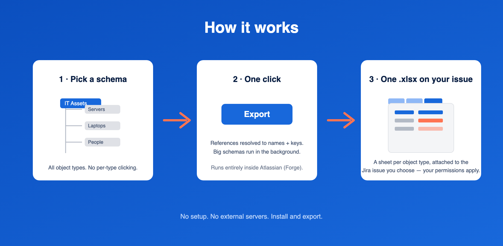

# Assets Exporter for Jira Service Management — Documentation

Export a whole Assets object schema to one Excel file — every object type,
every reference resolved.

## What it does

Jira Service Management's built-in export handles one object type at a time,
as CSV, with links between objects reduced to raw IDs. Assets Exporter
produces a single `.xlsx` from an entire object schema:

- **One sheet per object type**, named as the type is named in Assets.
- **References resolved into two columns**: the linked object's readable name
  (e.g. `Dell XPS 15`) and its object key (e.g. `SRV-1234`). People read the
  first, scripts read the second. Multi-valued references join both columns
  with `; ` in matching order.
- **Inherited attributes included** — a child type's sheet carries the columns
  it shows in Assets, including those defined on parent types.
- **An Overview sheet first**: schema name, export time, one row per object
  type with its object count, and a count of references pointing outside the
  exported schema — so you can verify the export is complete at a glance.
- The workbook is **attached to a Jira issue** you choose, so it inherits your
  existing Jira permissions and audit trail.

## Requirements

- Jira Service Management on Atlassian Cloud with **Assets** (available on
  Standard plans and above since 2026).
- Permission to install Marketplace apps, and a Jira issue to receive exports.

## Getting started

1. Install the app from the Atlassian Marketplace.
2. Open **Apps → Assets Exporter** in Jira's top navigation.
3. Pick an object schema from the list.
4. Enter the key of the issue that should receive the file (e.g. `ITSM-42`).
5. Click **Export**. When it finishes, follow the link to the issue and
   download the attachment.

Small schemas export in seconds. Schemas with many object types run as a
background job — the page shows progress and you can leave and come back.

## How large can a schema be?

The exporter is built for whole-schema exports and streams the workbook rather
than assembling it in memory. It has been exercised on schemas with dozens of
object types and workbooks of hundreds of thousands of rows. Very large
schemas simply take longer; the export runs in the background.

## Data handling

The app runs entirely on Atlassian Forge — no external servers, no data
egress. See the [Privacy Policy](privacy.html). License terms:
[EULA](eula.html).

## Troubleshooting

**The export fails with a permissions error.** The app reads Assets as itself
(not as the clicking user). If your Assets object schema restricts access via
its Roles configuration, add the app under the schema's roles (Schema settings
→ Roles).

**A reference column shows a key but the file has no sheet for it.** The
reference points at an object in a different schema — the Overview sheet
counts these. Export that schema separately if you need the target rows.

**The issue key is rejected.** The app needs an existing issue it can attach
files to; check the key and that the project allows attachments.

## Support

Contact us via the support link on the Marketplace listing. Include your
schema's object type count and the approximate object count — it speeds up
diagnosis.
