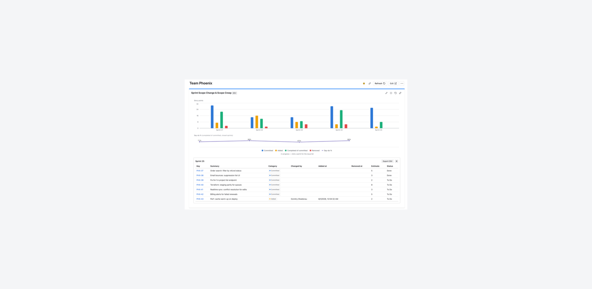
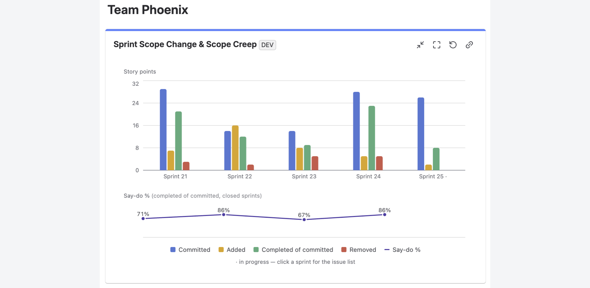

# Sprint Scope Change & Scope Creep — Documentation

A Jira dashboard gadget that shows how each sprint's scope changed after it
started: what the team committed to, what was added mid-sprint, what was
removed, and the say-do ratio — with a drill-down to the exact issues and a
CSV export.

## What it does

Jira's native Sprint Report marks issues added after the sprint started with an
asterisk, and that's about it. This gadget reconstructs the full picture from
the Sprint field's change history:

- **Committed** — issues that were in the sprint at the moment it started.
- **Added** — issues that entered the sprint after start: when, and by whom.
- **Removed** — issues taken out mid-sprint. An issue added *and* removed in
  the same sprint shows in both categories — churn is not hidden.
- **Say-do %** — the share of committed issues completed by sprint end
  (issues removed from the commitment count as not done).
- **Trend across recent sprints** (3–12), story points or issue count, with
  the current sprint shown in progress.
- **Drill-down**: click a sprint to see the issue list with categories, who
  changed the scope and when, estimates and statuses — and export it as CSV.

## Getting started

1. Install the app from the Atlassian Marketplace.
2. Open any Jira dashboard → **Add gadget** → search for “Sprint Scope Change”.
3. In the gadget settings, pick a **board**, the number of sprints to show,
   and units (auto uses story points when the board has estimates).
4. Save. Closed sprints are cached, so subsequent loads are fast.

Works with company-managed and team-managed Scrum boards. The story-points
field is read from each board's estimation settings — no configuration needed.

## How the numbers are computed

The gadget reads the sprint's issues and the Sprint-field change history of
issues updated since the sprint started (all with the viewing user's
permissions — users see only what they are allowed to see in Jira). The
commitment baseline is reconstructed from that history, so removed issues are
found even though Jira's JQL cannot query them.

**Known limitation:** an issue moved out of its project during a sprint cannot
be tracked, because its history is no longer reachable from the board's
projects. Story points are read at viewing time, not as of the sprint dates.

## Permissions

Read-only scopes for boards, sprints and issues, plus app storage for caching
closed-sprint results. The app runs entirely on Atlassian Forge with **no
egress**: your data never leaves Atlassian's infrastructure.

## Support

Questions or problems: see [Support](../support.html) — portal and email,
response within one business day.

- [Privacy policy](privacy.html)
- [End User License Agreement](eula.html)
